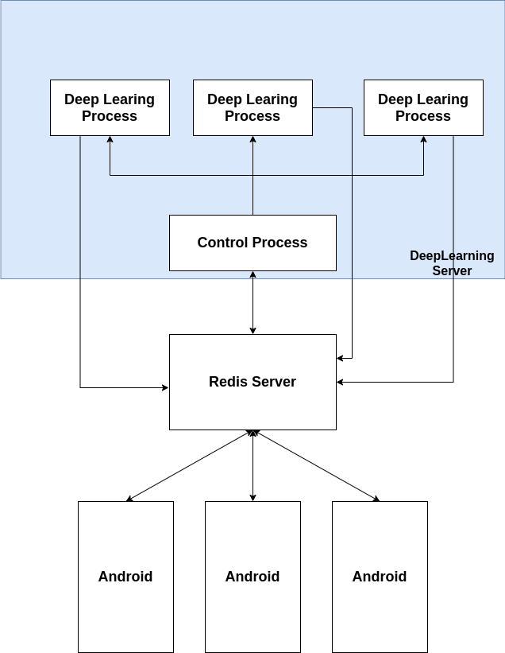
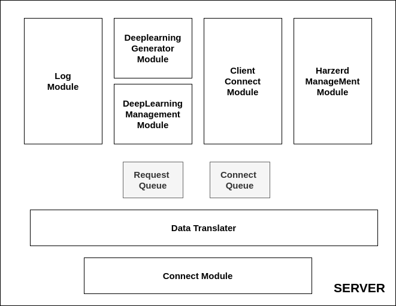

# HarmoAIComposorModule
멜로디 작곡 서버

## Specification
### DeepLearning
* Tensorflow: 2.1(GPU) + Keras
* Model: Magenta Melody Model
* Language: Python
### Main Server
* DB-Server: Redis
* Language: Python(or Golang), Shell
### Python Packages
* tensorflow-gpu
* redis(python)

## 전체 구성도

* **DeepLearningProcess:** AI 작곡을 담당하며 Control Process 로부터 받은 요청 데이터에 따라 상황에 맞게 작동한다.
* **Control Process:** Server 제어를 담당하며 GPU할당량 조절, 안드로이드 클라이언트 관리, DeepLearningProcess, Redis Server를 제어한다.
* **Redis Server:** 딥러닝 서버와 안드로이드 통신을 중계하며, 딥러닝 서버의 Ram확보를 위해 따로 서버를 구축해서 사용한다. 이를 중계하는 프로세스는 딥러닝 프로세스.

## 모듈 구성도

* **Connect Module:** 클라이언트와의 통신을 할 때 사용되는 모듈 pub/sub를 사용하므로 정확히는 Redis와 통신을 한다.
* **Data Translater:** Connect Module로부터 데이터를 수신했다면 이 데이터가 올바른 데이터인지 확인을 해야 할 필요가 있다. 올바른 데이터일 경우 다른 모듈로 넘어가고 그렇지 않으면 버리거나 추적을 하여 강제 연결 종료를 수행해야 한다. 이렇게 걸러진 데이터는 RequestData나 ConnectData로 가공한 후 Queue로 보내진다.
* **RequestQueue, ConnectQueue:** 데이터 큐
* **LogModule:** 클라이언트와 서버 간에 통신 내역을 저장하는 모듈, 파일을 사용할 가능성이 높다.(가능하다면 확장기능으로 로그분석을 하는 프로그램을 따로 작성할 예정, 나아가 이를 활용하여 작곡 장르 분포도도 조사 가능)
* **DeepLearningManagement Module:** 딥러닝 프로세스들을 테이블화 하여 관리하며 상황에 따라 프로세스 생성을 제어할 수 있어야 한다. 예를들어 최대 프로세스 생성 갯수가 3개라면 클라이언트로부터 요청이 들어왔을 때 
* **DeepLearningGenerator Module:** 딥러닝 프로세스 생성 모듈
* **Client Connect Module:** 클라이언트와의 연결 상태를 담당
* **Harzerd ManageMent Module:** 서버에 이상이 생기는 경우, 복구를 담당하는데 상황에 따라서 구현 할 수도 있고 안할 수도 있음
## 보완 사항
* Redis를 이용하여 안전한 통신을 할수 있으나 Redis 상태를 제어할 수 있는 트리거나 프로그램을 따로 작성을 해야 할 가능성이 높다.
* 아이디어를 낸 지 얼마 안됐기 때문에 설계와 구현을 동시에 신중하게 해야 할 필요 있음
### 참고 소스코드
https://github.com/Re-Coma/Classical-Piano-Composer